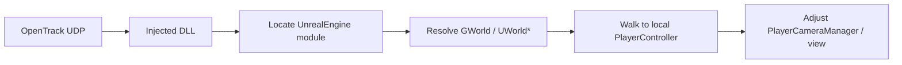

# Unreal Engine runtime injection notes (Azimuth FreeLook)

This document captures how **shipping** Unreal games are usually approached from an **external/injected** module, what we implemented first, and what comes next. It is meant for contributors, not end users.

## What “UE-to-VR” style tools are doing (high level)

Projects like [UEVR](https://github.com/praydog/UEVR) (see upstream licensing separately) and the MIT-licensed [RE-UE4SS](https://github.com/UE4SS-RE/RE-UE4SS) ecosystem solve the same core problem: **a stripped `UnrealEngine-Win64-*.dll` has almost no stable exports**, so mods recover engine state by scanning for **globals** and walking **reflection-shaped memory** (`UObject`, `UClass`, `UWorld`, …).

Azimuth FreeLook intentionally targets a **narrow slice**: **pose → camera / view**. We still need the same **bootstrap** steps (find the engine module, find `UWorld*`, then later `APlayerCameraManager`, etc.).

## Key objects (glossary)

- **`UWorld`**: root of a running map/world instance. Many mods start here.
- **`UGameInstance`**: holds `LocalPlayers` (`TArray<ULocalPlayer*>` in engine terms).
- **`APlayerController`**: per-local-player controller; references `APlayerCameraManager` for view control in many games.
- **`GNames` / `GUObjectArray`**: global name tables and object registry. Useful for advanced introspection; we may add later for auto-discovery.

## How we bootstrap today (in this repo)

1. **Find the engine module** in the current process (`EnumProcessModules` + filename heuristics).
2. **Sniff an embedded build label** from `.rdata` (strings like `++UE5+Release-5.x-…` are commonly embedded by Epic’s build pipeline). This is **diagnostic** only for now.
3. **Scan `.text` for a small set of “RIP-relative MOV → UWorld*” patterns**, resolve the displacement, read the pointer, and apply a **cheap sanity check**: the candidate pointer’s **vtable** points at **executable** memory (`VirtualQuery` on the vtable slot). This intentionally allows vtables that live in the **game executable** as well as the engine DLL (common for game-specific `UWorld` subclasses).

This is **best-effort** and **game/version dependent**:

- Patterns drift across engine minor versions.
- Some titles rename modules, statically link differently, or ship anti-tamper that blocks reads.
- False positives are possible; treat logs as hints, not proof.

For a broader modding platform with per-title configs and AOB maintenance workflows, see RE-UE4SS’s documentation and community guides (MIT).

## What we have not done yet (next engineering milestones)

1. **Stable `UWorld` → local `APlayerCameraManager` chain** without shipping PDBs requires **per-engine layout offsets** (or a generated SDK / dumper output). Expect a **profile system** (JSON) keyed by game + build label.
2. **Apply additive rotation** in a way that survives game updates (camera manager vs `FMinimalViewInfo` vs pawn bone) — title-specific.
3. **Threading / tick timing**: run adjustments **after** the game’s camera update when needed (hooking a known virtual function or engine callback), rather than blindly racing the game thread.
4. **OpenTrack ingestion inside the DLL** (Winsock UDP receiver + smoothing).

## Legal / practical warnings

- Injecting into **multiplayer / anti-cheat protected** titles is unsafe for accounts and often violates terms of service.
- Prefer **offline single-player** titles for development and testing.

## References (external)

- OpenTrack UDP packet layout: [UDP Network protocol](https://opentrack-opentrack.mintlify.app/protocols/udp)
- RE-UE4SS (MIT): [UE4SS-RE/RE-UE4SS](https://github.com/UE4SS-RE/RE-UE4SS)
- Epic’s engine source (for understanding layouts): Unreal Engine GitHub access is governed by Epic’s EULA and linking requirements.
